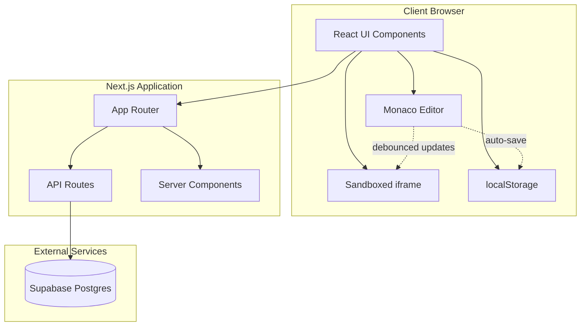

# Design Document: HTML Playground

## Overview

The HTML Playground is a client-side web application built with Next.js 14+ that provides an interactive code editing environment for HTML, CSS, and JavaScript. The system enables real-time preview of code changes and allows users to share their work globally via unique URLs without authentication requirements.

The architecture follows a client-server model where the Next.js application handles both the React-based frontend and API routes for snippet persistence. The Monaco editor provides the code editing experience, while a sandboxed iframe ensures secure preview rendering. Supabase serves as the persistence layer with Row Level Security configured for public read/write access.

Key design principles:
- Client-side rendering for immediate feedback and responsiveness
- Security through iframe sandboxing and payload size limits
- Simplicity through anonymous sharing without authentication overhead
- Resilience through local draft auto-save and graceful error handling

## Architecture

### System Components



### Component Responsibilities

**Client Components:**
- `EditorComponent`: Wraps Monaco editor, handles code input, syntax highlighting, and keyboard shortcuts
- `PreviewPane`: Manages sandboxed iframe, debounces updates, handles preview rendering
- `TabBar`: Switches between HTML/CSS/JS in multi-file mode
- `SplitPaneLayout`: Provides resizable divider between editor and preview
- `ThemeToggle`: Manages dark/light theme switching
- `FileUploadButton`: Handles file selection and drag-drop
- `ShareButton`: Triggers snippet save and displays share URL
- `DownloadButton`: Generates and downloads HTML file

**Server Components:**
- `SnippetLoader`: Fetches snippet data from Supabase on initial page load
- `ErrorBoundary`: Catches and displays errors gracefully

**API Routes:**
- `POST /api/snippets`: Creates new snippet, returns unique ID
- `GET /api/snippets/[id]`: Retrieves snippet by ID

**Data Layer:**
- Supabase client for database operations
- localStorage for draft persistence and user preferences

### Data Flow

**Creating and Sharing a Snippet:**
1. User writes code in Monaco editor
2. Code auto-saves to localStorage every 1 second
3. User clicks Share button
4. Client sends POST request to `/api/snippets` with code payload
5. API route validates payload size (≤500KB)
6. API route inserts snippet into Supabase
7. Supabase returns unique ID
8. Client generates share URL and displays to user
9. Client clears localStorage draft

**Loading a Shared Snippet:**
1. User navigates to `/[snippetId]`
2. Server component fetches snippet from Supabase
3. Server component renders page with snippet data
4. Client hydrates Monaco editor with snippet content
5. Client renders preview in sandboxed iframe

**Live Preview Updates:**
1. User types in Monaco editor
2. Editor onChange event fires
3. Debounce function delays update by 500ms
4. Preview component constructs HTML document
5. Preview component updates iframe srcdoc attribute
6. Browser renders updated content in iframe

### Security Model

**Iframe Sandboxing:**
- `sandbox="allow-scripts"` attribute restricts iframe capabilities
- No `allow-same-origin` prevents access to parent window
- No `allow-forms`, `allow-popups`, or `allow-top-navigation`
- User code executes in isolated context

**Payload Size Limits:**
- 500KB maximum per snippet enforced at API layer
- Prevents database bloat and DoS attacks
- Client-side validation provides immediate feedback

**Row Level Security:**
- Supabase RLS policies allow public INSERT and SELECT
- No UPDATE or DELETE to prevent snippet modification
- Snippets are immutable once created

**Content Security:**
- No server-side code execution
- All user code runs client-side in sandbox
- XSS protection through iframe isolation

## Components and Interfaces

### Monaco Editor Integration

```typescript
interface EditorProps {
  value: string;
  language: 'html' | 'css' | 'javascript';
  onChange: (value: string) => void;
  theme: 'vs-dark' | 'vs-light';
}

interface EditorState {
  html: string;
  css: string;
  javascript: string;
  mode: 'single' | 'multi';
  activeTab: 'html' | 'css' | 'javascript';
}
```

The Monaco editor component wraps `@monaco-editor/react` and provides:
- Language-specific syntax highlighting and IntelliSense
- Configurable theme matching application theme
- Standard editor features (line numbers, folding, minimap)
- Keyboard shortcuts (Ctrl+Z, Ctrl+Y, Ctrl+F, etc.)

### Preview Pane Component

```typescript
interface PreviewPaneProps {
  html: string;
  css: string;
  javascript: string;
  mode: 'single' | 'multi';
}

function PreviewPane({ html, css, javascript, mode }: PreviewPaneProps) {
  const [srcdoc, setSrcdoc] = useState('');
  
  useEffect(() => {
    const timer = setTimeout(() => {
      setSrcdoc(constructDocument(html, css, javascript, mode));
    }, 500); // Debounce 500ms
    
    return () => clearTimeout(timer);
  }, [html, css, javascript, mode]);
  
  return (
    <iframe
      sandbox="allow-scripts"
      srcdoc={srcdoc}
      className="w-full h-full border-0"
    />
  );
}

function constructDocument(
  html: string,
  css: string,
  js: string,
  mode: 'single' | 'multi'
): string {
  if (mode === 'single') {
    return html;
  }
  
  return `
    <!DOCTYPE html>
    <html>
      <head>
        <style>${css}</style>
      </head>
      <body>
        ${html}
        <script>${js}</script>
      </body>
    </html>
  `;
}
```

### Split Pane Layout

```typescript
interface SplitPaneProps {
  left: React.ReactNode;
  right: React.ReactNode;
  defaultRatio?: number;
}

function SplitPane({ left, right, defaultRatio = 0.5 }: SplitPaneProps) {
  const [ratio, setRatio] = useState(() => {
    const saved = localStorage.getItem('splitRatio');
    return saved ? parseFloat(saved) : defaultRatio;
  });
  
  const handleDrag = (e: MouseEvent) => {
    const newRatio = e.clientX / window.innerWidth;
    setRatio(newRatio);
    localStorage.setItem('splitRatio', newRatio.toString());
  };
  
  // Implementation with drag handlers
}
```

### API Route Interfaces

```typescript
// POST /api/snippets
interface CreateSnippetRequest {
  html: string;
  css: string;
  javascript: string;
  mode: 'single' | 'multi';
}

interface CreateSnippetResponse {
  id: string;
  url: string;
}

interface ErrorResponse {
  error: string;
  details?: string;
}

// GET /api/snippets/[id]
interface GetSnippetResponse {
  id: string;
  html: string;
  css: string;
  javascript: string;
  mode: 'single' | 'multi';
  created_at: string;
}
```

### File Upload Handler

```typescript
interface FileUploadHandler {
  accept: '.html,.htm,.css,.js';
  maxSize: 500 * 1024; // 500KB
  onUpload: (content: string, type: 'html' | 'css' | 'javascript') => void;
  onError: (error: string) => void;
}

async function handleFileUpload(file: File, handler: FileUploadHandler) {
  if (file.size > handler.maxSize) {
    handler.onError('File size exceeds 500KB limit');
    return;
  }
  
  const content = await file.text();
  const extension = file.name.split('.').pop()?.toLowerCase();
  
  const typeMap: Record<string, 'html' | 'css' | 'javascript'> = {
    'html': 'html',
    'htm': 'html',
    'css': 'css',
    'js': 'javascript'
  };
  
  const type = typeMap[extension || ''];
  if (type) {
    handler.onUpload(content, type);
  }
}
```

### Download Handler

```typescript
function downloadSnippet(
  html: string,
  css: string,
  js: string,
  mode: 'single' | 'multi'
) {
  const content = mode === 'single' 
    ? html 
    : constructDocument(html, css, js, mode);
  
  const blob = new Blob([content], { type: 'text/html' });
  const url = URL.createObjectURL(blob);
  const timestamp = new Date().toISOString().replace(/[:.]/g, '-');
  const filename = `snippet-${timestamp}.html`;
  
  const a = document.createElement('a');
  a.href = url;
  a.download = filename;
  a.click();
  
  URL.revokeObjectURL(url);
}
```

### Local Storage Manager

```typescript
interface LocalDraft {
  html: string;
  css: string;
  javascript: string;
  mode: 'single' | 'multi';
  timestamp: number;
}

class LocalStorageManager {
  private static DRAFT_KEY = 'html-playground-draft';
  private static THEME_KEY = 'html-playground-theme';
  private static SPLIT_RATIO_KEY = 'html-playground-split-ratio';
  
  static saveDraft(draft: Omit<LocalDraft, 'timestamp'>) {
    const data: LocalDraft = { ...draft, timestamp: Date.now() };
    localStorage.setItem(this.DRAFT_KEY, JSON.stringify(data));
  }
  
  static loadDraft(): LocalDraft | null {
    const data = localStorage.getItem(this.DRAFT_KEY);
    return data ? JSON.parse(data) : null;
  }
  
  static clearDraft() {
    localStorage.removeItem(this.DRAFT_KEY);
  }
  
  static saveTheme(theme: 'dark' | 'light') {
    localStorage.setItem(this.THEME_KEY, theme);
  }
  
  static loadTheme(): 'dark' | 'light' {
    return (localStorage.getItem(this.THEME_KEY) as 'dark' | 'light') || 'dark';
  }
  
  static saveSplitRatio(ratio: number) {
    localStorage.setItem(this.SPLIT_RATIO_KEY, ratio.toString());
  }
  
  static loadSplitRatio(): number {
    const saved = localStorage.getItem(this.SPLIT_RATIO_KEY);
    return saved ? parseFloat(saved) : 0.5;
  }
}
```

## Data Models

### Database Schema

```sql
-- Supabase table definition
CREATE TABLE snippets (
  id UUID PRIMARY KEY DEFAULT gen_random_uuid(),
  html TEXT NOT NULL,
  css TEXT NOT NULL DEFAULT '',
  javascript TEXT NOT NULL DEFAULT '',
  mode VARCHAR(10) NOT NULL CHECK (mode IN ('single', 'multi')),
  created_at TIMESTAMPTZ NOT NULL DEFAULT NOW(),
  
  -- Size constraint enforced at application layer
  CONSTRAINT payload_size_check CHECK (
    octet_length(html) + octet_length(css) + octet_length(javascript) <= 512000
  )
);

-- Index for fast lookups
CREATE INDEX idx_snippets_created_at ON snippets(created_at DESC);

-- Row Level Security policies
ALTER TABLE snippets ENABLE ROW LEVEL SECURITY;

-- Allow public read access
CREATE POLICY "Allow public read access"
  ON snippets FOR SELECT
  USING (true);

-- Allow public insert access
CREATE POLICY "Allow public insert access"
  ON snippets FOR INSERT
  WITH CHECK (true);

-- No UPDATE or DELETE policies (immutable snippets)
```

### TypeScript Types

```typescript
// Core domain types
type EditorMode = 'single' | 'multi';
type EditorLanguage = 'html' | 'css' | 'javascript';
type Theme = 'dark' | 'light';

interface Snippet {
  id: string;
  html: string;
  css: string;
  javascript: string;
  mode: EditorMode;
  created_at: string;
}

interface EditorContent {
  html: string;
  css: string;
  javascript: string;
}

interface AppState {
  content: EditorContent;
  mode: EditorMode;
  activeTab: EditorLanguage;
  theme: Theme;
  splitRatio: number;
  isLoading: boolean;
  error: string | null;
  shareUrl: string | null;
}

// Serialization types
interface SnippetPayload {
  html: string;
  css: string;
  javascript: string;
  mode: EditorMode;
}

interface SerializedSnippet {
  id: string;
  payload: string; // JSON stringified SnippetPayload
  created_at: string;
}
```

### State Management

The application uses React hooks for state management:

```typescript
function useEditorState() {
  const [content, setContent] = useState<EditorContent>({
    html: '',
    css: '',
    javascript: ''
  });
  const [mode, setMode] = useState<EditorMode>('single');
  const [activeTab, setActiveTab] = useState<EditorLanguage>('html');
  
  // Auto-save to localStorage
  useEffect(() => {
    const timer = setTimeout(() => {
      LocalStorageManager.saveDraft({ ...content, mode });
    }, 1000);
    
    return () => clearTimeout(timer);
  }, [content, mode]);
  
  // Load draft on mount
  useEffect(() => {
    const draft = LocalStorageManager.loadDraft();
    if (draft) {
      setContent({
        html: draft.html,
        css: draft.css,
        javascript: draft.javascript
      });
      setMode(draft.mode);
    }
  }, []);
  
  return {
    content,
    setContent,
    mode,
    setMode,
    activeTab,
    setActiveTab
  };
}
```

### Validation Rules

**Payload Size Validation:**
```typescript
function validatePayloadSize(payload: SnippetPayload): boolean {
  const totalSize = 
    new Blob([payload.html]).size +
    new Blob([payload.css]).size +
    new Blob([payload.javascript]).size;
  
  return totalSize <= 500 * 1024; // 500KB
}
```

**File Upload Validation:**
```typescript
function validateFileUpload(file: File): { valid: boolean; error?: string } {
  const validExtensions = ['.html', '.htm', '.css', '.js'];
  const extension = '.' + file.name.split('.').pop()?.toLowerCase();
  
  if (!validExtensions.includes(extension)) {
    return { valid: false, error: 'Invalid file type' };
  }
  
  if (file.size > 500 * 1024) {
    return { valid: false, error: 'File size exceeds 500KB limit' };
  }
  
  return { valid: true };
}
```

**Snippet ID Validation:**
```typescript
function validateSnippetId(id: string): boolean {
  // UUID v4 format
  const uuidRegex = /^[0-9a-f]{8}-[0-9a-f]{4}-4[0-9a-f]{3}-[89ab][0-9a-f]{3}-[0-9a-f]{12}$/i;
  return uuidRegex.test(id);
}
```


## Correctness Properties

*A property is a characteristic or behavior that should hold true across all valid executions of a system—essentially, a formal statement about what the system should do. Properties serve as the bridge between human-readable specifications and machine-verifiable correctness guarantees.*

### Property 1: Editor content updates in real-time

*For any* input string, when a user types it into the editor, the editor state should immediately contain that string.

**Validates: Requirements 1.4**

### Property 2: Preview iframe sandbox configuration

*For any* rendered preview pane, the iframe element should have sandbox="allow-scripts" and should NOT include allow-same-origin, allow-forms, allow-popups, or allow-top-navigation.

**Validates: Requirements 2.2, 2.3, 2.4**

### Property 3: Preview error isolation

*For any* user code that throws a runtime error, the error should be contained within the iframe and the parent application should remain functional.

**Validates: Requirements 2.5**

### Property 4: Single-file mode accepts inline styles and scripts

*For any* valid HTML content containing inline CSS and JavaScript, single-file mode should accept and preserve that content without modification.

**Validates: Requirements 3.4**

### Property 5: Mode switching preserves content

*For any* editor content, switching from single-file mode to multi-file mode and back to single-file mode should preserve the original content.

**Validates: Requirements 3.5**


### Property 6: Multi-file document construction

*For any* HTML, CSS, and JavaScript content in multi-file mode, the constructed preview document should contain all three pieces of content in the appropriate locations (CSS in head, HTML in body, JS at end of body).

**Validates: Requirements 3.6**

### Property 7: Snippet save operation persists data

*For any* valid snippet content, saving it to the database should result in the snippet being retrievable by its generated ID.

**Validates: Requirements 4.1**

### Property 8: Snippet ID uniqueness

*For any* two distinct save operations, the generated snippet IDs should be different.

**Validates: Requirements 4.2**

### Property 9: Snippet persistence round-trip

*For any* valid snippet (HTML, CSS, JavaScript, mode), saving it to the database and then loading it by ID should return an equivalent snippet with all fields preserved.

**Validates: Requirements 4.3, 5.1, 5.2, 5.3**

### Property 10: Payload size limit enforcement

*For any* snippet payload, if the total size exceeds 500KB then the save operation should fail with an error, and if the size is 500KB or less then the save operation should succeed.

**Validates: Requirements 4.4, 4.5**

### Property 11: Share URL contains snippet ID

*For any* successfully saved snippet, the returned share URL should contain the snippet's unique identifier.

**Validates: Requirements 4.6**


### Property 12: Preview renders loaded snippet

*For any* loaded snippet, the preview pane should display the rendered output of the snippet's HTML, CSS, and JavaScript content.

**Validates: Requirements 5.4**

### Property 13: localStorage draft round-trip

*For any* editor state (HTML, CSS, JavaScript, mode), saving it to localStorage and then loading it should return an equivalent editor state with all fields preserved.

**Validates: Requirements 6.2, 6.3**

### Property 14: Successful share clears localStorage draft

*For any* editor content, after successfully sharing the snippet, the localStorage draft should be cleared (empty).

**Validates: Requirements 6.4**

### Property 15: localStorage stores only most recent draft

*For any* sequence of editor state changes, only the most recent state should be stored in localStorage (not a history of states).

**Validates: Requirements 6.5**

### Property 16: File extension validation

*For any* file with extension .html, .htm, .css, or .js, the upload should be accepted; for any file with a different extension, the upload should be rejected.

**Validates: Requirements 7.3**


### Property 17: HTML file upload populates editor

*For any* HTML file content, uploading the file should result in the editor containing that exact content.

**Validates: Requirements 7.4**

### Property 18: CSS/JS file upload switches to multi-file mode

*For any* CSS or JavaScript file upload, the system should switch to multi-file mode and populate the corresponding tab (CSS tab for .css files, JavaScript tab for .js files).

**Validates: Requirements 7.5, 7.6**

### Property 19: File size limit enforcement for uploads

*For any* file, if the file size exceeds 500KB then the upload should fail with an error, and if the size is 500KB or less then the upload should succeed.

**Validates: Requirements 7.8**

### Property 20: Download in single-file mode preserves content

*For any* editor content in single-file mode, downloading should produce an HTML file containing that exact content.

**Validates: Requirements 8.2**

### Property 21: Download in multi-file mode combines content

*For any* HTML, CSS, and JavaScript content in multi-file mode, downloading should produce a single HTML file with inline CSS and JavaScript that matches the preview output.

**Validates: Requirements 8.3, 8.5**

### Property 22: Download filename format

*For any* download operation, the generated filename should match the pattern "snippet-[timestamp].html" where timestamp is a valid ISO timestamp.

**Validates: Requirements 8.4**


### Property 23: Split pane resize updates ratio

*For any* drag position on the split pane divider, the pane ratio should update to reflect the new position.

**Validates: Requirements 9.3**

### Property 24: Split ratio localStorage persistence

*For any* split pane ratio value, saving it to localStorage and then loading it should return the same ratio value.

**Validates: Requirements 9.4**

### Property 25: Theme toggle switches themes

*For any* current theme (dark or light), clicking the theme toggle should switch to the opposite theme.

**Validates: Requirements 10.3**

### Property 26: Theme applies to Monaco editor

*For any* selected theme, the Monaco editor should receive the corresponding theme configuration (vs-dark for dark theme, vs-light for light theme).

**Validates: Requirements 10.4**

### Property 27: Theme applies to application UI

*For any* selected theme, the application UI should have the corresponding theme class applied to the root element.

**Validates: Requirements 10.5**

### Property 28: Theme localStorage persistence

*For any* theme selection (dark or light), saving it to localStorage and then loading it should return the same theme value.

**Validates: Requirements 10.6, 10.7**


### Property 29: Error logging to console

*For any* error condition in the application, the error should be logged to the browser console using console.error.

**Validates: Requirements 11.5**

### Property 30: Serialization round-trip

*For any* valid snippet object, serializing it to JSON and then deserializing it back should produce an equivalent object with all fields preserved, including special characters in HTML, CSS, and JavaScript content.

**Validates: Requirements 13.1, 13.2, 13.3, 13.4, 13.6**

## Error Handling

The application implements comprehensive error handling across all major operations:

### Network and Database Errors

**Supabase Connection Failures:**
- Catch network errors when connecting to Supabase
- Display user-friendly message: "Unable to connect to database"
- Allow continued local editing with localStorage
- Log detailed error to console for debugging

**Snippet Load Failures:**
- Handle 404 errors for non-existent snippet IDs
- Display message: "Snippet not found"
- Load empty editor to allow user to start fresh
- Handle malformed JSON responses gracefully

**Snippet Save Failures:**
- Catch database write errors
- Display message: "Failed to save snippet"
- Retain editor content so user doesn't lose work
- Suggest retry or local download as fallback


### File Upload Errors

**Invalid File Type:**
- Validate file extension before reading
- Display message: "Invalid file type. Please upload .html, .htm, .css, or .js files"
- Prevent file from being processed

**File Size Exceeded:**
- Check file size before reading content
- Display message: "File size exceeds 500KB limit"
- Prevent file from being loaded

**File Read Errors:**
- Catch FileReader errors
- Display message: "Failed to read file"
- Log error details to console

### Payload Validation Errors

**Size Limit Exceeded:**
- Calculate total payload size before save
- Display message: "Snippet size exceeds 500KB limit. Please reduce content."
- Show current size and limit for user reference
- Prevent save operation

**Invalid Data:**
- Validate snippet structure before serialization
- Handle missing required fields
- Display message: "Invalid snippet data"

### Preview Rendering Errors

**User Code Runtime Errors:**
- Errors in user code are isolated to iframe
- Errors appear in browser console but don't crash app
- Preview pane remains functional
- Parent application continues working normally

**Iframe Loading Errors:**
- Handle iframe load failures
- Display message in preview pane: "Preview failed to load"
- Allow user to continue editing


### localStorage Errors

**Quota Exceeded:**
- Catch QuotaExceededError when saving drafts
- Display message: "Local storage is full. Please clear browser data or share your snippet."
- Continue allowing editing (just without auto-save)

**localStorage Unavailable:**
- Detect if localStorage is disabled (private browsing)
- Display warning: "Local auto-save is disabled. Your work will not be saved automatically."
- Allow continued use without persistence

### Error Logging Strategy

All errors are logged to the browser console with:
- Error type and message
- Stack trace for debugging
- Context information (operation being performed, relevant data)
- Timestamp

Example error logging:
```typescript
function logError(operation: string, error: Error, context?: any) {
  console.error(`[HTML Playground] ${operation} failed:`, {
    error: error.message,
    stack: error.stack,
    context,
    timestamp: new Date().toISOString()
  });
}
```

### User-Facing Error Messages

All error messages follow these principles:
- Clear and concise language
- Explain what went wrong
- Suggest next steps when possible
- Avoid technical jargon
- Maintain calm, helpful tone


## Testing Strategy

### Dual Testing Approach

The HTML Playground will use both unit testing and property-based testing to ensure comprehensive coverage:

**Unit Tests** focus on:
- Specific examples that demonstrate correct behavior
- Edge cases and boundary conditions
- Error handling scenarios
- Integration points between components
- UI component rendering

**Property-Based Tests** focus on:
- Universal properties that hold for all inputs
- Comprehensive input coverage through randomization
- Round-trip properties (serialization, persistence)
- Invariants that must be maintained
- Data transformation correctness

Both approaches are complementary and necessary. Unit tests catch concrete bugs and verify specific scenarios, while property tests verify general correctness across a wide range of inputs.

### Property-Based Testing Configuration

**Library Selection:**
- Use `fast-check` for TypeScript/JavaScript property-based testing
- Mature library with good TypeScript support
- Integrates well with Jest/Vitest

**Test Configuration:**
- Minimum 100 iterations per property test (due to randomization)
- Each property test must reference its design document property
- Tag format: `// Feature: html-playground, Property {number}: {property_text}`

**Example Property Test:**
```typescript
import fc from 'fast-check';

// Feature: html-playground, Property 9: Snippet persistence round-trip
test('snippet save/load preserves all fields', () => {
  fc.assert(
    fc.property(
      fc.record({
        html: fc.string(),
        css: fc.string(),
        javascript: fc.string(),
        mode: fc.constantFrom('single', 'multi')
      }),
      async (snippet) => {
        const id = await saveSnippet(snippet);
        const loaded = await loadSnippet(id);
        
        expect(loaded.html).toBe(snippet.html);
        expect(loaded.css).toBe(snippet.css);
        expect(loaded.javascript).toBe(snippet.javascript);
        expect(loaded.mode).toBe(snippet.mode);
      }
    ),
    { numRuns: 100 }
  );
});
```


### Unit Testing Strategy

**Component Testing:**
- Test React components with React Testing Library
- Verify rendering, user interactions, and state updates
- Mock external dependencies (Monaco, Supabase)

**API Route Testing:**
- Test Next.js API routes with supertest or similar
- Verify request/response handling
- Test validation and error cases
- Mock Supabase client

**Utility Function Testing:**
- Test pure functions in isolation
- Cover edge cases and boundary conditions
- Test error handling

**Example Unit Tests:**

```typescript
// UI Component Test
describe('ThemeToggle', () => {
  it('should toggle between dark and light themes', () => {
    const { getByRole } = render(<ThemeToggle />);
    const button = getByRole('button');
    
    expect(document.documentElement.classList.contains('dark')).toBe(true);
    
    fireEvent.click(button);
    expect(document.documentElement.classList.contains('light')).toBe(true);
    
    fireEvent.click(button);
    expect(document.documentElement.classList.contains('dark')).toBe(true);
  });
});

// Error Handling Test
describe('Snippet API', () => {
  it('should return 404 for non-existent snippet', async () => {
    const response = await request(app)
      .get('/api/snippets/non-existent-id')
      .expect(404);
    
    expect(response.body.error).toBe('Snippet not found');
  });
  
  it('should reject payloads over 500KB', async () => {
    const largeSnippet = {
      html: 'x'.repeat(600 * 1024),
      css: '',
      javascript: '',
      mode: 'single'
    };
    
    const response = await request(app)
      .post('/api/snippets')
      .send(largeSnippet)
      .expect(400);
    
    expect(response.body.error).toContain('500KB');
  });
});
```


### Test Coverage Goals

**Target Coverage:**
- 80%+ line coverage for business logic
- 100% coverage for critical paths (save, load, serialization)
- All error handling paths tested
- All correctness properties implemented as property tests

**Critical Test Areas:**
1. Serialization/deserialization (round-trip property)
2. Snippet persistence (save/load round-trip)
3. localStorage operations (draft persistence)
4. File upload validation and processing
5. Payload size validation
6. Error handling for all failure modes
7. Preview iframe sandboxing
8. Theme switching and persistence
9. Mode switching with content preservation
10. Download file generation

### Testing Tools and Setup

**Test Framework:**
- Vitest for unit and property tests
- Fast, ESM-native, TypeScript support

**Testing Libraries:**
- `@testing-library/react` for component testing
- `@testing-library/user-event` for user interactions
- `fast-check` for property-based testing
- `msw` for API mocking

**Test Organization:**
```
__tests__/
  components/
    Editor.test.tsx
    PreviewPane.test.tsx
    ThemeToggle.test.tsx
    SplitPane.test.tsx
  api/
    snippets.test.ts
  utils/
    serialization.test.ts
    validation.test.ts
    localStorage.test.ts
  properties/
    snippet-persistence.property.test.ts
    serialization.property.test.ts
    file-upload.property.test.ts
    theme-persistence.property.test.ts
```

### Continuous Integration

- Run all tests on every pull request
- Fail build if any test fails
- Generate coverage reports
- Run property tests with increased iterations (1000+) in CI for deeper validation

